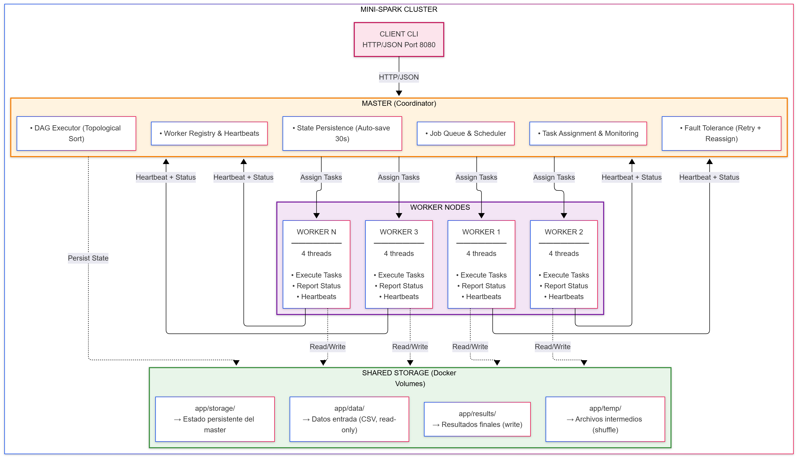

# Mini-Spark

> **Sistema de procesamiento distribuido batch desde cero en Go, sin frameworks externos**

[](https://go.dev/)
[](https://www.docker.com/)
[](LICENSE)

Mini-Spark es una implementación educativa de un motor de procesamiento distribuido tipo MapReduce/Spark, desarrollado completamente en Go sin dependencias externas (solo stdlib). Soporta ejecución de trabajos batch mediante DAGs con 7 operadores, tolerancia a fallos, balanceo de carga y persistencia de estado.

---

## Tabla de Contenidos

- [Características Principales](#-características-principales)
- [Inicio Rápido](#-inicio-rápido)
- [Arquitectura](#-arquitectura)
- [Estructura del Proyecto](#-estructura-del-proyecto)
- [Operadores Disponibles](#-operadores-disponibles)
- [API REST](#-api-rest)
- [Configuración](#️-configuración)
- [Ejemplos de Uso](#-ejemplos-de-uso)
- [Cliente CLI](#-cliente-cli)
- [Desarrollo](#-desarrollo)
- [Testing](#-testing)
- [Comandos Make](#-comandos-make)
- [Tecnologías](#-tecnologías)
- [Documentación Adicional](#-documentación-adicional)
- [Créditos](#-créditos)

---

## ✨ Características Principales

### Core Features
- **Procesamiento Distribuido**: Cluster con 1 Master + N Workers (por defecto 3)
- **DAG Execution**: Ejecución de grafos acíclicos dirigidos con ordenamiento topológico
- **7 Operadores**: `read_csv`, `map`, `filter`, `flat_map`, `reduce_by_key`, `aggregate`, `join`
- **API REST**: HTTP/JSON con 8 endpoints para gestión completa
- **CLI Client**: Cliente de línea de comandos con colores y monitoreo en tiempo real

### Tolerancia a Fallos
- **Heartbeats**: Detección automática de workers caídos (cada 2s, timeout 10s)
- **Auto-retry**: Hasta 3 reintentos por tarea fallida
- **Reasignación**: Redistribución automática de tareas a workers disponibles
- **Persistencia**: Auto-save del estado del master cada 30s

### Performance y Escalabilidad
- **Concurrencia**: 4 threads por worker (configurable)
- **Particionamiento**: Hash-based partitioning para distribución eficiente
- **Cache + Spill**: Sistema de cache en memoria (100MB) con spill a disco
- **Métricas**: Monitoreo de CPU/memoria por worker en tiempo real
- **Load Balancing**: Balanceo dinámico basado en carga de workers

### DevOps
- **Docker Compose**: Deploy completo con un solo comando
- **Sin Dependencias**: Solo Go stdlib, binarios standalone
- **Makefile**: 15+ comandos para automatización completa
- **Logging**: Sistema de logs estructurados con niveles (DEBUG/INFO/WARN/ERROR)

---

## Inicio Rápido

### Prerequisitos

```bash
# Verificar instalaciones
docker --version          # Docker 20.10+
docker compose version    # Docker Compose 2.0+
go version               # Go 1.21+ (solo para desarrollo local)
```

### Desplegar el Cluster

```bash
# Clonar el repositorio
git clone https://github.com/juandjimenezjdjv/Proy_2_SO.git
cd Proy_2_SO

# Iniciar cluster (1 master + 3 workers)
make up

# Verificar estado
make status

# Ver logs en tiempo real
make logs
```

**Salida esperada:**

```
✓ Cluster iniciado
Master API: http://localhost:8080
Health check: http://localhost:8080/health

Estado del Cluster:
NAME                  STATUS    PORTS
minispark-master      Up        0.0.0.0:8080->8080/tcp
minispark-worker1     Up
minispark-worker2     Up
minispark-worker3     Up
```

### Primera Consulta

```bash
# Health check
curl http://localhost:8080/health

# Listar workers registrados
curl http://localhost:8080/api/v1/workers | jq

# Listar jobs
curl http://localhost:8080/api/v1/jobs | jq
```

### Enviar un Job de Ejemplo

```bash
# Usando el cliente CLI
./client -master http://localhost:8080 \
         -cmd submit \
         -job examples/wordcount_job.json \
         -watch

# O directamente con curl
curl -X POST http://localhost:8080/api/v1/jobs \
     -H "Content-Type: application/json" \
     -d @examples/aggregate_sales.json
```

---

## 🏗️ Arquitectura

### Diagrama de Componentes



### Componentes

#### 1. **Master (Coordinador Principal)**

**Responsabilidades:**
- **Registry**: Mantiene lista de workers activos/inactivos
- **Heartbeat Monitor**: Detecta workers caídos (timeout 10s)
- **Job Queue**: Cola de trabajos pendientes
- **Scheduler**: Asigna tareas a workers según carga
- **DAG Executor**: Ordena y ejecuta nodos del DAG
- **Fault Tolerance**: Reintenta tareas fallidas (max 3) y reasigna
- **Persistence**: Guarda estado cada 30s en `app/storage/`
- **API REST**: Expone 8 endpoints HTTP/JSON en puerto 8080

**Archivos clave:**
- `master/main.go` (servidor HTTP + orquestación)

#### 2. **Workers (Nodos de Ejecución)**

**Responsabilidades:**
- **Task Execution**: Ejecuta operadores asignados (map, filter, etc.)
- **Concurrency**: 4 threads paralelos (configurable)
- **Heartbeats**: Envía latido cada 2s al master
- **Status Reporting**: Reporta estado de tareas (PENDING → RUNNING → COMPLETED/FAILED)
- **Data Processing**: Lee de `app/data/`, escribe en `app/temp/` o `app/results/`
- **Cache Management**: Cache en memoria (100MB) + spill a disco

**Archivos clave:**
- `worker/main.go` (registro, heartbeat, task polling, ejecución)

#### 3. **Client CLI**

**Responsabilidades:**
- **Job Submission**: Envía jobs desde JSON al master
- **Monitoring**: Consulta estado de jobs en tiempo real
- **Watch Mode**: Monitoreo continuo hasta completar job
- **Pretty Print**: Salida coloreada con ANSI codes

**Archivos clave:**
- `client/main.go` (CLI con flags, client HTTP)

#### 4. **Common (Paquete Compartido)**

**Módulos:**
- `types.go` → Estructuras: Job, Task, DAG, Worker, OperatorType
- `protocol.go` → Requests/Responses para API REST
- `config.go` → Configuración desde env vars
- `logger.go` → Sistema de logging estructurado
- `cache.go` → Cache en memoria con LRU eviction
- `persistence.go` → Serialización de estado del master
- `partitioning.go` → Hash-based partitioning para shuffle
- `metrics.go` → Métricas de CPU/memoria por worker

---

## 📂 Estructura del Proyecto

```
Proy_2_SO/
├── master/
│   ├── main.go                # Master server (API REST + orquestación)
│   └── Dockerfile             # Imagen Docker del master
│
├── worker/
│   ├── main.go                # Worker node (ejecutor de tareas)
│   └── Dockerfile             # Imagen Docker del worker
│
├── client/
│   ├── main.go                # Cliente CLI (submit, status, list, health)
│   └── Dockerfile             # Imagen Docker del cliente
│
├── common/                    # Paquete compartido (core types & utils)
│   ├── types.go               # Job, Task, DAG, Worker, OperatorType
│   ├── protocol.go            # Requests/Responses para API
│   ├── config.go              # Configuración desde env vars
│   ├── logger.go              # Logging estructurado
│   ├── cache.go               # Sistema de cache con spill a disco
│   ├── persistence.go         # Serialización de estado
│   ├── partitioning.go        # Hash partitioning para shuffle
│   └── metrics.go             # Métricas de CPU/memoria
│
├── examples/                  # Jobs de ejemplo (JSON)
│   ├── wordcount_job.json     # WordCount clásico (4 operadores)
│   ├── aggregate_sales.json   # Agregación por ciudad
│   ├── join_job.json          # Join de users + orders
│   ├── complete_pipeline.json # Pipeline completo (10 tareas)
│   └── ...                    # Otros ejemplos
│
├── app/                       # Runtime del sistema (volúmenes Docker)
│   ├── data/                  # Datos de entrada (CSV)
│   │   ├── users.csv          # Ejemplo: 10,000 usuarios
│   │   ├── orders.csv         # Ejemplo: 50,000 órdenes
│   │   ├── sales_data.csv     # Ejemplo: datos de ventas
│   │   └── .gitkeep
│   │
│   ├── results/               # Resultados finales procesados
│   │   └── .gitkeep
│   │
│   ├── storage/               # Estado persistente del master
│   │   ├── master_state_*.json  # Snapshots del estado
│   │   └── .gitkeep
│   │
│   ├── temp/                  # Archivos intermedios (shuffle)
│   │   └── .gitkeep
│   │
│   └── scripts/               # Scripts de utilidad
│       └── generate_test_data.py  # Genera datasets de prueba
│
├── docs/                      # Documentación del proyecto
│   ├── Manual de uso.md       # Manual de usuario
│   ├── Informe.tex            # Informe académico (LaTeX)
│   └── Informe.pdf            # PDF compilado
│
├── imgs/
│   └── arquitectura.png       # Diagrama de arquitectura
│
├── benchmarks/                # Pruebas de rendimiento
│   └── README.md              # Resultados de benchmarks
│
├── docker-compose.yml         # Orquestación del cluster
├── Makefile                   # Automatización (up, down, logs, test)
├── go.mod                     # Módulo Go
├── .env.example               # Variables de entorno de ejemplo
├── .gitignore                 # Exclusiones de Git
├── .dockerignore              # Exclusiones de Docker
├── README.md                  # Este archivo
└── TODO.md                    # Tareas pendientes
```

### Directorios Clave

| Directorio | Propósito | Descripción |
|-----------|----------|-------------|
| `master/` | Coordinador | Servidor HTTP que orquesta el cluster |
| `worker/` | Ejecutores | Nodos que procesan tareas en paralelo |
| `client/` | CLI | Cliente de línea de comandos |
| `common/` | Librería | Código compartido (tipos, protocolos, utils) |
| `examples/` | Ejemplos | Jobs de prueba en formato JSON |
| `app/data/` | Entradas | Datasets CSV de entrada (read-only en workers) |
| `app/results/` | Salidas | Resultados finales procesados |
| `app/storage/` | Persistencia | Estado del master (auto-save cada 30s) |
| `app/temp/` | Intermedios | Archivos temporales durante shuffle |
| `app/scripts/` | Utilidades | Scripts Python para generar datos |
| `docs/` | Documentación | Manual de uso e informe académico |

---

## Operadores Disponibles

Mini-Spark soporta **7 operadores** para construir pipelines de procesamiento:

### 1. **read_csv** - Lectura de Archivos

**Descripción**: Lee archivos CSV y los particiona para procesamiento paralelo.

**Parámetros:**
- `input_paths`: Array de rutas a archivos CSV
- `output_path`: Ruta de salida
- `partitions`: Número de particiones (default: 1)

**Ejemplo:**
```json
{
  "id": "read",
  "operator": "read_csv",
  "input_paths": ["users.csv"],
  "output_path": "temp/users_read.csv",
  "partitions": 4
}
```

---

### 2. **map** - Transformación 1:1

**Descripción**: Aplica una función a cada registro, produciendo exactamente un registro de salida por cada entrada.

**Parámetros:**
- `input_paths`: Array con 1 ruta de entrada
- `output_path`: Ruta de salida
- `partitions`: Número de particiones
- `params.fn`: Función a aplicar (string)

**Ejemplo:**
```json
{
  "id": "normalize",
  "operator": "map",
  "input_paths": ["temp/data.csv"],
  "output_path": "temp/normalized.csv",
  "partitions": 4,
  "params": {
    "fn": "lambda x: x.upper()"
  }
}
```

---

### 3. **filter** - Filtrado

**Descripción**: Filtra registros que cumplan una condición (predicate).

**Parámetros:**
- `input_paths`: Array con 1 ruta de entrada
- `output_path`: Ruta de salida
- `partitions`: Número de particiones
- `params.fn`: Predicado (retorna true/false)

**Ejemplo:**
```json
{
  "id": "filter_active",
  "operator": "filter",
  "input_paths": ["temp/users.csv"],
  "output_path": "temp/active_users.csv",
  "partitions": 2,
  "params": {
    "fn": "lambda x: x['status'] == 'active'"
  }
}
```

---

### 4. **flat_map** - Transformación 1:N

**Descripción**: Aplica una función que produce 0 o más registros por cada entrada (útil para tokenización, split, etc.).

**Parámetros:**
- `input_paths`: Array con 1 ruta de entrada
- `output_path`: Ruta de salida
- `partitions`: Número de particiones
- `params.fn`: Función que retorna array/lista

**Ejemplo (WordCount):**
```json
{
  "id": "tokenize",
  "operator": "flat_map",
  "input_paths": ["temp/documents.csv"],
  "output_path": "temp/words.csv",
  "partitions": 4,
  "params": {
    "fn": "split_words"
  }
}
```

**Casos de uso:**
- Tokenización de texto → `["hello world"] → ["hello", "world"]`
- Split de arrays → `["a,b,c"] → ["a", "b", "c"]`
- Expansión de registros → `[{tags: ["tag1", "tag2"]}] → [{tag: "tag1"}, {tag: "tag2"}]`

---

### 5. **reduce_by_key** - Reducción por Clave

**Descripción**: Agrupa registros por una clave y aplica una función de reducción (sum, count, avg, etc.).

**Parámetros:**
- `input_paths`: Array con 1 ruta de entrada
- `output_path`: Ruta de salida
- `partitions`: Número de particiones (para shuffle)
- `params.key`: Columna que actúa como clave de agrupación
- `params.fn`: Función de reducción (`sum`, `count`, `avg`, `min`, `max`)

**Ejemplo (WordCount):**
```json
{
  "id": "count_words",
  "operator": "reduce_by_key",
  "input_paths": ["temp/words.csv"],
  "output_path": "results/word_counts.csv",
  "partitions": 2,
  "params": {
    "key": "word",
    "fn": "count"
  }
}
```

**Ejemplo (Suma de ventas por ciudad):**
```json
{
  "id": "sum_by_city",
  "operator": "reduce_by_key",
  "input_paths": ["temp/sales.csv"],
  "output_path": "results/sales_by_city.csv",
  "partitions": 4,
  "params": {
    "key": "city",
    "fn": "sum"
  }
}
```

---

### 6. **aggregate** - Agregación Simple

**Descripción**: Calcula estadísticas agregadas sobre una columna (sum, count, avg, min, max).

**Parámetros:**
- `input_paths`: Array con 1 ruta de entrada
- `output_path`: Ruta de salida
- `params.function`: Función de agregación (`sum`, `count`, `avg`, `min`, `max`)
- `params.value_column`: Índice de la columna a agregar (0-based)

**Ejemplo:**
```json
{
  "id": "total_revenue",
  "operator": "aggregate",
  "input_paths": ["temp/sales.csv"],
  "output_path": "results/total_revenue.csv",
  "params": {
    "function": "sum",
    "value_column": 2
  }
}
```

---

### 7. **join** - Join de Datasets

**Descripción**: Realiza un join (inner) de dos datasets por una clave común.

**Parámetros:**
- `input_paths`: Array con 2 rutas (left, right)
- `output_path`: Ruta de salida
- `partitions`: Número de particiones
- `params.join_key`: Nombre de la columna clave
- `params.join_type`: Tipo de join (`inner`, `left`, `right`, `full`)

**Ejemplo (Users + Orders):**
```json
{
  "id": "join_users_orders",
  "operator": "join",
  "input_paths": ["temp/users.csv", "temp/orders.csv"],
  "output_path": "results/user_orders.csv",
  "partitions": 4,
  "params": {
    "join_key": "user_id",
    "join_type": "inner"
  }
}
```

---

### Tabla Resumen de Operadores

| Operador | Tipo | Entrada | Salida | Caso de Uso |
|----------|------|---------|--------|-------------|
| `read_csv` | Source | Archivos | Particiones | Leer datasets |
| `map` | Transformation | 1 registro | 1 registro | Normalizar, transformar |
| `filter` | Transformation | 1 registro | 0-1 registro | Filtrar por condición |
| `flat_map` | Transformation | 1 registro | 0-N registros | Tokenizar, split |
| `reduce_by_key` | Aggregation | N registros | 1 por clave | WordCount, Group By |
| `aggregate` | Aggregation | N registros | 1 resultado | Suma total, promedio |
| `join` | Transformation | 2 datasets | 1 dataset | Combinar datos |

---

## 🌐 API REST

El **Master** expone una API HTTP/JSON en el puerto **8080** con los siguientes endpoints:

### Endpoints Disponibles

#### 1. **Health Check**

```bash
GET /health
```

**Descripción**: Verifica que el master está activo.

**Respuesta exitosa (200):**
```json
{
  "status": "healthy",
  "timestamp": "2025-11-27T10:30:00Z"
}
```

**Ejemplo:**
```bash
curl http://localhost:8080/health
```

---

#### 2. **Listar Workers**

```bash
GET /api/v1/workers
```

**Descripción**: Obtiene la lista de workers registrados con su estado.

**Respuesta exitosa (200):**
```json
{
  "workers": [
    {
      "id": "worker1-abc123",
      "address": "worker1:8080",
      "status": "UP",
      "threads": 4,
      "last_heartbeat": "2025-11-27T10:29:58Z",
      "tasks_completed": 42,
      "tasks_failed": 1
    }
  ]
}
```

**Ejemplo:**
```bash
curl http://localhost:8080/api/v1/workers | jq
```

---

#### 3. **Registrar Worker**

```bash
POST /api/v1/workers/register
Content-Type: application/json
```

**Descripción**: Registra un nuevo worker en el cluster (usado por los workers al iniciar).

**Respuesta exitosa (200):**
```json
{
  "status": "registered",
  "worker_id": "worker1-abc123"
}
```

---

#### 4. **Enviar Heartbeat**

```bash
POST /api/v1/workers/heartbeat
Content-Type: application/json
```

**Descripción**: Workers envían heartbeat cada 2 segundos para indicar que están activos.

**Respuesta exitosa (200):**
```json
{
  "status": "ok"
}
```

---

#### 5. **Crear Job**

```bash
POST /api/v1/jobs
Content-Type: application/json
```

**Descripción**: Envía un job para ejecución.

**Respuesta exitosa (201):**
```json
{
  "job_id": "my-job-123",
  "status": "ACCEPTED",
  "message": "Job submitted successfully"
}
```

**Ejemplo:**
```bash
curl -X POST http://localhost:8080/api/v1/jobs \
     -H "Content-Type: application/json" \
     -d @examples/wordcount_job.json
```

---

#### 6. **Listar Jobs**

```bash
GET /api/v1/jobs
```

**Descripción**: Obtiene la lista de todos los jobs enviados.

**Respuesta exitosa (200):**
```json
{
  "jobs": [
    {
      "id": "job-1",
      "name": "WordCount",
      "status": "SUCCEEDED",
      "progress": 100.0
    }
  ]
}
```

**Ejemplo:**
```bash
curl http://localhost:8080/api/v1/jobs | jq
```

---

#### 7. **Obtener Job por ID**

```bash
GET /api/v1/jobs/{job_id}
```

**Descripción**: Obtiene el detalle completo de un job específico, incluyendo todas sus tareas.

**Ejemplo:**
```bash
curl http://localhost:8080/api/v1/jobs/job-1 | jq
```

---

#### 8. **Actualizar Estado de Tarea**

```bash
POST /api/v1/tasks/update
Content-Type: application/json
```

**Descripción**: Workers usan este endpoint para reportar cambios en el estado de una tarea.

**Respuesta exitosa (200):**
```json
{
  "status": "updated"
}
```

---

### Tabla Resumen de Endpoints

| Método | Endpoint | Descripción | Usado por |
|--------|----------|-------------|-----------|
| `GET` | `/health` | Health check | Cliente, Monitoreo |
| `GET` | `/api/v1/workers` | Listar workers | Cliente |
| `POST` | `/api/v1/workers/register` | Registrar worker | Worker |
| `POST` | `/api/v1/workers/heartbeat` | Enviar heartbeat | Worker |
| `POST` | `/api/v1/jobs` | Crear job | Cliente |
| `GET` | `/api/v1/jobs` | Listar jobs | Cliente |
| `GET` | `/api/v1/jobs/{id}` | Detalle de job | Cliente |
| `POST` | `/api/v1/tasks/update` | Actualizar tarea | Worker |

---

## ⚙️ Configuración

### Variables de Entorno

Todas las configuraciones se pueden personalizar mediante variables de entorno. Crea un archivo `.env` en la raíz (usa `.env.example` como template):

```bash
cp .env.example .env
```

#### Configuración del Master

| Variable | Default | Descripción |
|----------|---------|-------------|
| `MASTER_HOST` | `0.0.0.0` | Host del servidor HTTP del master |
| `MASTER_PORT` | `8080` | Puerto del servidor HTTP del master |
| `DATA_DIR` | `./app/data` | Directorio de datos de entrada |
| `RESULTS_DIR` | `./app/results` | Directorio de resultados |
| `LOG_LEVEL` | `INFO` | Nivel de logging (`DEBUG`, `INFO`, `WARN`, `ERROR`) |

#### Configuración de Workers

| Variable | Default | Descripción |
|----------|---------|-------------|
| `MASTER_HOST` | `localhost` | Host del master para conectarse |
| `MASTER_PORT` | `8080` | Puerto del master |
| `WORKER_THREADS` | `4` | Número de threads concurrentes por worker |
| `MAX_RETRIES` | `3` | Reintentos máximos por tarea fallida |
| `MAX_MEMORY_MB` | `100` | Límite de memoria para cache (MB) |
| `LOG_LEVEL` | `INFO` | Nivel de logging |

#### Configuración de Heartbeats

| Variable | Default | Descripción |
|----------|---------|-------------|
| `HEARTBEAT_SEC` | `2` | Intervalo de heartbeats (segundos) |
| `HEARTBEAT_TIMEOUT_SEC` | `10` | Timeout para marcar worker como DOWN (segundos) |

---

## 💡 Ejemplos de Uso

El directorio `examples/` contiene jobs predefinidos listos para ejecutar.

### Generar Datos de Prueba

```bash
cd app/scripts
python3 generate_test_data.py

# Verifica los archivos generados
ls -lh ../data/
```

---

### Ejemplo 1: WordCount

**Archivo:** `examples/wordcount_job.json`

**Ejecutar:**
```bash
./client -master http://localhost:8080 \
         -cmd submit \
         -job examples/wordcount_job.json \
         -watch
```

---

### Ejemplo 2: Agregación de Ventas

**Archivo:** `examples/aggregate_sales.json`

**Ejecutar:**
```bash
./client -master http://localhost:8080 \
         -cmd submit \
         -job examples/aggregate_sales.json

cat app/results/aggregate_sales_by_city.csv
```

---

### Ejemplo 3: Join de Users + Orders

**Archivo:** `examples/join_job.json`

**Ejecutar:**
```bash
./client -master http://localhost:8080 \
         -cmd submit \
         -job examples/join_job.json
```

---

## 🖥️ Cliente CLI

### Compilar el Cliente

```bash
cd client
go build -o client .
./client --help
```

### Comandos Disponibles

#### Submit Job
```bash
./client -master http://localhost:8080 \
         -cmd submit \
         -job examples/wordcount_job.json \
         -watch
```

#### Consultar Estado
```bash
./client -master http://localhost:8080 \
         -cmd status \
         -id wordcount-example
```

#### Listar Jobs
```bash
./client -master http://localhost:8080 \
         -cmd list
```

#### Health Check
```bash
./client -master http://localhost:8080 \
         -cmd health
```

---

## 🛠️ Desarrollo

### Configurar Entorno

```bash
git clone https://github.com/juandjimenezjdjv/Proy_2_SO.git
cd Proy_2_SO
go version  # 1.21+
go mod tidy
```

### Compilar Localmente

```bash
make build         # Compilar todos
make build-master  # Solo master
make build-worker  # Solo worker
```

### Ejecutar sin Docker

**Terminal 1 - Master:**
```bash
export MASTER_HOST=localhost
export MASTER_PORT=8080
go run master/main.go
```

**Terminal 2 - Worker:**
```bash
export MASTER_HOST=localhost
export MASTER_PORT=8080
go run worker/main.go
```

### Formatear y Linting

```bash
make fmt   # Formatear código
make lint  # Ejecutar linter
```

---

## 🧪 Testing

### Pruebas Unitarias

```bash
make test          # Ejecutar todas
go test ./... -v   # Con verbose
go test ./... -cover  # Con coverage
```

### Pruebas de Integración

```bash
make test-integration
```

### Benchmarks

```bash
cat benchmarks/README.md
```

---

## 📦 Comandos Make

### Docker
- `make up` - Iniciar cluster
- `make down` - Detener cluster
- `make restart` - Reiniciar cluster
- `make status` - Estado del cluster

### Logs
- `make logs` - Ver logs de todos
- `make logs-master` - Logs del master
- `make logs-workers` - Logs de workers

### Build
- `make build` - Compilar todos
- `make build-master` - Compilar master
- `make build-worker` - Compilar worker

### Testing
- `make test` - Pruebas unitarias
- `make test-integration` - Pruebas de integración

### Limpieza
- `make clean` - Limpiar temporales
- `make clean-all` - Limpieza completa

### Desarrollo
- `make fmt` - Formatear código
- `make lint` - Ejecutar linter
- `make demo` - Demo interactivo

---

## 🧰 Tecnologías

- **Go 1.21+**: Lenguaje principal
- **Go Stdlib**: Sin dependencias externas
- **HTTP/1.1**: Comunicación Master ↔ Workers
- **JSON**: Formato de datos
- **Docker + Compose**: Containerización
- **Makefile**: Automatización

---

## 📚 Documentación Adicional

- `docs/Manual de uso.md` - Manual de usuario
- `docs/Informe.tex` - Informe académico
- `docs/Informe.pdf` - PDF compilado
- `benchmarks/README.md` - Resultados de benchmarks
- `TODO.md` - Tareas pendientes

---

## 🎓 Créditos

### Proyecto Académico

- **Curso**: IC-6600 - Principios de Sistemas Operativos
- **Institución**: Tecnológico de Costa Rica (TEC)
- **Profesor**: Kenneth Obando Rodríguez
- **Fecha**: Noviembre 2025

### Equipo

- **Juan Diego Jiménez** - [@juandjimenezjdjv](https://github.com/juandjimenezjdjv)

### Uso de IA

Este proyecto utilizó **GitHub Copilot** como herramienta de apoyo para documentación, estructuras base y patrones de diseño. Todo el código fue revisado y adaptado por el equipo.

---

## 📄 Licencia

Proyecto académico - TEC Costa Rica

**Uso Académico**: Permitido con atribución  
**Uso Comercial**: No permitido sin autorización

---

## 🔗 Enlaces

- **Repositorio**: [https://github.com/juandjimenezjdjv/Proy_2_SO](https://github.com/juandjimenezjdjv/Proy_2_SO)
- **Issues**: [https://github.com/juandjimenezjdjv/Proy_2_SO/issues](https://github.com/juandjimenezjdjv/Proy_2_SO/issues)

---

<div align="center">

**Hecho en el TEC Costa Rica**

[](https://www.tec.ac.cr/)
[](https://go.dev/)
[](https://www.docker.com/)

</div>
